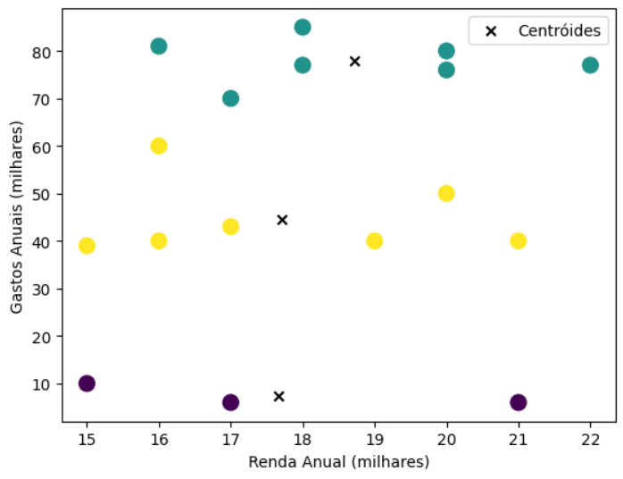

<h1>Clusterização de Clientes com o algoritmo Kmeans</h1>

[PYTHON]: https://img.shields.io/badge/Python-FFD43B?style=for-the-badge&logo=python&logoColor=blue
[COLAB]: https://img.shields.io/badge/Colab-F9AB00?style=for-the-badge&logo=googlecolab&color=525252
[JUPYTER]: https://img.shields.io/badge/Jupyter-F37626.svg?&style=for-the-badge&logo=Jupyter&logoColor=white

![Phyton][PYTHON]
![Google Colab][COLAB]
![Jupyter Notebook][JUPYTER]

 <a href="#about">Sobre</a> • 
 <a href="#started">Instrução de uso</a> •
 <a href="#technologies">Tecnologias utilizadas</a> •
 <a href="#contribute">Contribuição</a> •
 <a href="#links">Links úteis</a> 

    

<h2 id="about">📌 Sobre</h2>

Primeiramente, usei o algoritmo de "K-means clustering" para segmentar clientes de uma empresa fictícia com base em duas variáveis: renda anual e gastos anuais. Logo em sequência, implementei a abordagem utilizando a biblioteca "Scikit-Learn" na linguagem de programação Python, destacando o processo de inicialização dos centróides, atribuição de clientes e ajuste dos centróides até a convergência do modelo.

Você pode acessá-lo [aqui](https://colab.research.google.com/gist/EricHidekiMiyahara/83af4e3f8340490643e418f22ff55169/clusterizacaoclientes.ipynb).

<h2 id="started">Instrução de uso</h2>

Aqui você decide como rodar seu próprio projeto.

1. Primeiramente, você vai ter que ir no arquivo "ClusterizacaoClientes.ipynb".
2. Segundamente, clique em Open in Colab para abrir o arquivo no Google Colab.
3. Por fim, não é necessário você rodar o 1º e o 2º exemplo, pois já vai estar apresentado os gráficos correspondentes. Mas, você pode alterar o valor de clusters máximo na variável "limite_k" para enfim verificar como que esse valor afeta no gráfico como todo.

<h2 id="technologies">Tecnologias utilizadas</h2>

- **Python:** Linguagem de programação
- **Google Colab:** IDE

<h2 id="contribute">📫 Contribuição</h2>

Agradeço a contribuição para o projeto. Se você está corrigindo um bug, adicionando uma funcionalidade, ou melhorando a documentação, sua contribuição é valiosa. Veja como você pode contribuir:

1. **Criar uma nova funcionalidade**

Você pode criar mais variáveis para a empresa ou criar mais exemplos de uso do algoritmo K-Means.

2. **Siga os padrões de codificação**

Consistência é fundamental! Aderir aos padrões de codificação e padrões estabelecidos no projeto. Isso garante a legibilidade e a manutenção do código.

3. **Espere pela revisão**

Irei rever a sua solicitação de pull. Participe da discussão e faça as alterações solicitadas. Suas contribuições serão mescladas no projeto uma vez aprovada!

<h3 id="links">Links Úteis</h3>

- [Projeto](https://colab.research.google.com/gist/EricHidekiMiyahara/83af4e3f8340490643e418f22ff55169/clusterizacaoclientes.ipynb)
- [Artigo](https://www.linkedin.com/feed/update/urn:li:activity:7251697145542549504/)
